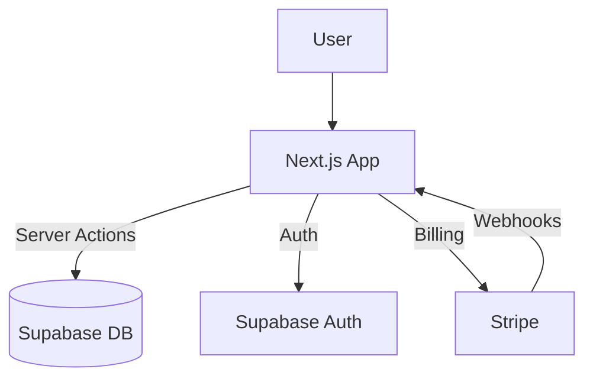

# Architecture

## Stack

| Layer | Technology | Why |
|-------|-----------|-----|
| Frontend | Next.js 15 + React 19 | App Router, Server Components |
| Styling | Tailwind CSS 4 | Productivity |
| Auth | Supabase Auth | Built-in OAuth + RLS |
| Database | Supabase (PostgreSQL) | Managed, generous free tier |
| Storage | Supabase Storage | Integrated with auth |
| Billing | Stripe + stripe-js | Standard |
| Deploy | Vercel | Zero-config Next.js |

## Data Flow

## Key Decisions

| Decision | Rationale | Date |
|----------|-----------|------|
| Server Components default | Performance, smaller client bundle | 2026-01-05 |
| Supabase over Firebase | PostgreSQL + RLS + open source | 2026-01-05 |
| Server Actions over API routes | Less boilerplate, type-safe | 2026-01-05 |
