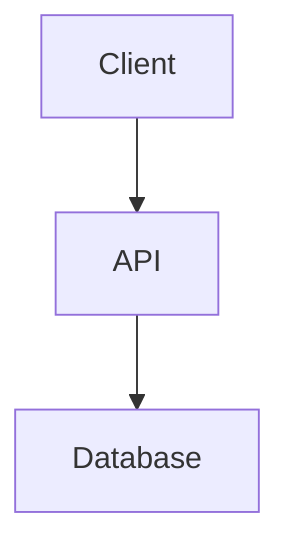

# Architecture

## Stack

| Layer | Technology | Why |
|-------|-----------|-----|
| Frontend | | |
| Backend | | |
| Database | | |
| Hosting | | |

## System Diagram

## Key Decisions

| Decision | Rationale | Date |
|----------|-----------|------|
| | | |

## External Dependencies
- 

## Known Constraints
- 
